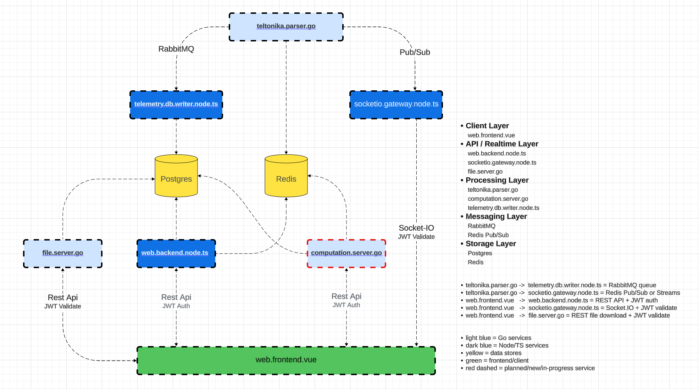

# iotrack.live

> **Work in Progress – Production-Oriented IoT Platform**

iotrack.live is a **modern IoT tracking and telemetry platform** designed around Teltonika devices.  
It is built as a **microservices-based system** with real-time processing, scalable ingestion, and clean separation of concerns.

This project also serves as a **technical showcase**, demonstrating backend architecture, real-time systems, and DevOps practices.

---

## Architecture

<p align="center">
  
</p>

---

## Overview

iotrack.live provides:

- Real-time GPS tracking
- Device telemetry ingestion and processing
- Asset and device management
- Scalable event-driven architecture
- Live updates via WebSockets (Socket.IO)

The system is designed to handle **high-frequency IoT data streams** while maintaining both:

- **durable storage (PostgreSQL)**
- **low-latency real-time delivery (Redis / Socket.IO)**

---

## Architecture


### Key Layers

- **Client Layer**
  - `web.frontend.vue`

- **API / Realtime Layer**
  - `web.backend.node.ts.api`
  - `socketio.gateway.node.ts`
  - `file.server.go`

- **Processing Layer**
  - `teltonika.parser.go`
  - `telemetry.db.writer.node.ts`
  - `computation.server.go` *(in progress)*

- **Messaging Layer**
  - RabbitMQ (queue-based processing)
  - Redis Pub/Sub (real-time streaming)

- **Storage Layer**
  - PostgreSQL (persistent storage)
  - Redis (cache + live state + pub/sub)

---

## ⚙️ Main Technologies

### Backend
- **Golang** (high-performance services, parsers, computation)
- **Node.js (TypeScript)** (API, workers, real-time gateway)

### Frontend
- **Vue 3**
- **Vite**
- **SASS**

### Databases
- **PostgreSQL**
- **Redis**

### Messaging / Streaming
- **RabbitMQ**
- *(Kafka planned / experimental)*

### Realtime
- **Socket.IO**

### DevOps / Infrastructure
- **Docker**
- **Docker Compose**
- **Linux (Ubuntu)**
- **Bash scripting**

### ORM / Data Layer
- **Prisma (Node.js services)**

### Security
- **JWT Authentication**
- Role & permission-based access (in progress)

---

## Data Flow (Simplified)

1. **Teltonika devices → `teltonika.parser.go`**
2. Parser:
   - sends telemetry → **RabbitMQ → DB writer**
   - publishes live updates → **Redis Pub/Sub → Socket.IO**
3. **telemetry.db.writer.node.ts**
   - persists data into PostgreSQL
4. **socketio.gateway.node.ts**
   - pushes live updates to frontend clients
5. **web.backend.node.ts.api**
   - provides REST API (auth, assets, devices, etc.)
6. **web.frontend.vue**
   - consumes REST + WebSocket streams

---

## Microservices

| Service                          | Description |
|----------------------------------|------------|
| `teltonika.parser.go`            | Parses raw device data and dispatches events |
| `telemetry.db.writer.node.ts`    | Writes telemetry data to PostgreSQL |
| `socketio.gateway.node.ts`       | Real-time communication layer |
| `web.backend.node.ts.api`        | Main REST API |
| `file.server.go`                 | File handling service |
| `computation.server.go`          | Aggregations / analytics *(planned)* |
| `web.frontend.vue`               | Vue frontend |

---

## Project Goals

This project is built to demonstrate:

- Microservice architecture design
- Event-driven systems (RabbitMQ / Redis)
- Real-time data pipelines
- Clean separation of concerns
- Scalable backend patterns
- IoT protocol handling (Teltonika)
- Production-style Docker setups

---

## Deployment

The system is designed to run via:

```bash
docker-compose up --build
```

Services are containerized and can be scaled independently.

---


## Future Improvements

- Kafka integration (stream processing)
- Advanced alerting system
- Analytics & aggregation engine
- Improved monitoring & observability (Prometheus / Grafana)

---

## Author

Chris Farrugia  
Backend / Full-Stack Developer  

## License

This project is currently private / internal use.
